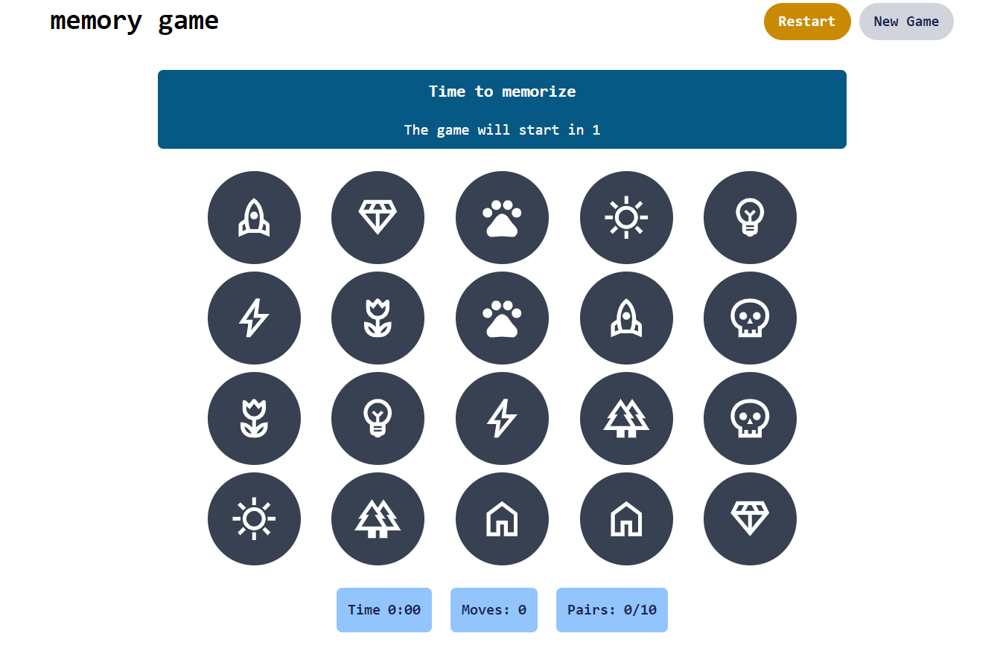

# Memory Game

This is a simple memory game inpired by the [Memory game on Frontend Mentor](https://www.frontendmentor.io/challenges/memory-game-vse4WFPvM). 

## Table of contents

- [Overview](#overview)
  - [The challenge](#the-challenge)
  - [App Preview](#app-preview)
  - [Links](#links)
- [My process](#my-process)
  - [Built with](#built-with)
- [Author](#author)

## Overview

### The challenge

Users should be able to:

- View the optimal layout for the app depending on their device's screen size
- See hover states for all interactive elements on the page
- Be able to start a new game everytime the button is pressed
- Be able to restart the same game that was been played
- See statics such as moves and timer

### App Preview

### Links

- Live Site URL: [Vercel](https://memory-game-tau-jet.vercel.app)
- Repository URL: [Github](https://github.com/noliv197/memory-game)

## My process

- First step was to build the components and style each of them
    - Set html structure as model and then transfer the dynamic ones to jquery
    - Style components using tailwind
    - For the flip effect I used the following references:
    - [Create a card flip animation with css](https://vanslaars.io/articles/create-a-card-flip-animation-with-css)
    - [How to design a css card flip animation](https://dev.to/adetutu/how-to-design-a-css-card-flip-animation-creating-flipping-cards-on-hover-5ha6)
- After stylization, the next step was to build the page dynamically using jquery
  - set up time interval functions like countdown and timer
  - set up board function: handle game customization according to the game status
  - create functions to handle each game status
  - the final implementation was the _handleCardClick_ function, to handle all the outcomes of a user clicking on a card during game.  

### Built with

- Semantic HTML5 markup
- Tailwind
- jquery

## Author

- Portfolio - [Natalia Oliveira](https://portfolio-zeta-rose-48.vercel.app)
- Linkedin - [Natalia Oliveira](https://www.linkedin.com/in/natália-m-oliveira/)